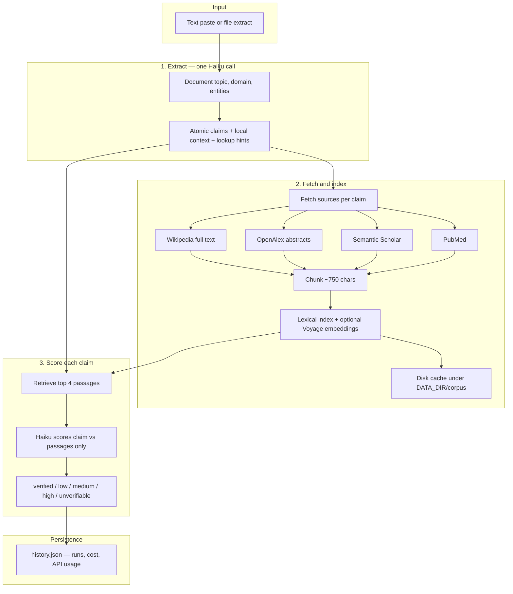
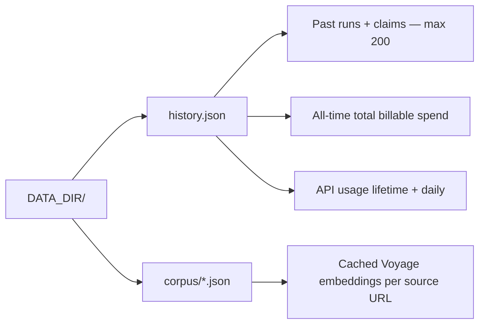

# Claim Inspector

An open-source fact-checking tool: paste or upload text, and each factual claim is checked against reputable sources, scored by risk, and highlighted in the UI. Runs, cumulative spend, and external API usage persist across restarts in `history.json`.

---

## User interface

After signing in, the main screen is a single page with status bars at the top, an input area, and results below.

### Top bars

**Cost bar (all-time / session)**  
Tracks **total billable spend** per run: Anthropic (Haiku) plus OpenAlex/Voyage after free-tier credits. Token counts are Haiku only.

| Field | Meaning |
|-------|---------|
| **All-time** | Total USD (Haiku + billable APIs) + Haiku input/output tokens since the server first saved a run |
| **This session** | USD and run count since you signed in (resets on page refresh) |

**API usage bar**  
Tracks **every external service** the backend calls. Counters live in `history.json` and reset daily (UTC) where providers have daily limits. Hover a provider name for notes. Orange bars mean ≥80% of a tracked limit.

| Provider | What is counted | Tracked limit |
|----------|-----------------|---------------|
| Anthropic | Input + output tokens | None (`MAX_COST_USD` is estimate-only preflight; see env table) |
| Voyage | Embedding tokens + API calls | 200M tokens free tier (account lifetime) |
| OpenAlex | Search calls + estimated USD | $1/day free API credit |
| Wikipedia | HTTP requests | 5,000/day soft budget |
| Semantic Scholar | HTTP requests | 5,000/day soft budget |
| PubMed | HTTP requests | 10,000/day soft budget |

Deleting a past run removes only the saved results; **cost** and **API usage** totals are unchanged (they track real API consumption).

### Header

Title row with **sign out**. Source line lists the databases the app can query (Wikipedia, OpenAlex, Semantic Scholar, PubMed).

### Past fact-checks

Collapsible history of saved runs (newest first, **max 200**). Each row shows date, mode (`sync` = instant, `batch`), claim count, flagged count, cost, **rename**, and **delete**.

**Click a row** to reload **claim results and cost** into the results panel. Original input text is **not stored** — only a short auto-title (~80 characters) for display. Annotated highlighting is unavailable for history loads; claim cards are complete.

### Input area

| Control | Purpose |
|---------|---------|
| **Input text** | Paste prose, or drag-and-drop a file |
| **load sample** | Fills the editor with demo frog text |
| **upload file** | `.txt`, `.md`, `.html`, `.docx`, `.pdf` |
| **Estimate pill** | Appears while typing — approximate claim count and **total** cost (Haiku + billable APIs) |
| **Name this fact-check** | Optional label stored in history (overrides auto title when set) |

**File upload behavior:**

- `.txt` / `.md` — read in the browser
- `.html` / `.docx` / `.pdf` — sent to `POST /extract/file` for server-side conversion, then loaded into the editor
- Files **>15,000 bytes** auto-enable batch mode
- Textarea length **>3,000 characters** shows a large-document batch suggestion banner

### Batch mode toggle

| | **Instant (default)** | **Batch** |
|---|----------------------|-----------|
| Speed | Seconds to a few minutes | Up to 24h (often minutes) |
| Haiku cost | Full Haiku pricing on extraction + scoring | Full price on **extraction**; **50% off scoring** only (Anthropic Batch API) |
| Progress | Live SSE stream (`POST /analyze/stream`) | Submit may take minutes (extract + index on server), then poll `GET /batch/:id` every 8s |
| Best for | Normal documents | Very large docs, rate-limit avoidance |

When batch is on, a blue panel shows estimated **total** cost and Haiku-only batch savings.

**Batch job caveat:** Job status is kept **in memory** on the server (not persisted). Completed runs are saved to `history.json`. If the **server restarts** while a batch is in flight, `GET /batch/:id` returns 404 — check **Past fact-checks** after a few minutes; the run may already be saved. If you **refresh the browser** mid-batch, polling stops; keep the tab open or check history later.

### Analyze and progress

**Analyze Claims** starts a run. Instant mode uses Server-Sent Events:

1. Status messages — e.g. *Extracting claims…*, *Indexing sources (chunk + retrieve)…*
2. Topic line after extraction (when available)
3. Progress bar — claims scored (`3/8 · 38%`) with the current claim snippet

**Last run** next to the button shows total cost (Haiku + billable APIs), with a Haiku/API split when applicable, plus token counts.

Instant runs have a **180-second server timeout**. Very large documents may need batch mode.

### Results

**Annotated text** (instant runs only) — click a highlighted claim to open its card.

**Risk colors**

| Color | Risk | Meaning |
|-------|------|---------|
| Green | Verified | On-topic sources clearly support the claim |
| Yellow | Low | Mostly supported; minor nuance |
| Orange | Medium | Partial support or oversimplification |
| Red | High | Sources contradict or show a major error |
| Gray | Unverifiable | No on-topic source addresses the claim |

**Claim cards** — explanation plus **Sources** links. Each source is a retrieved *passage* (not necessarily the whole article), labeled with provider (`wikipedia`, `openalex`, `semantic_scholar`, `pubmed`).

---

## How it works



**Why chunk + retrieve?** Full Wikipedia articles are too long to send to Haiku for every claim. The app indexes the full text once, then pulls only the passages that match each claim (keyword search, plus **Voyage** semantic search when `VOYAGE_API_KEY` is set).

**Provider routing** — not every database runs for every claim. Extraction assigns `providers` per claim (e.g. PubMed only for medical claims, OpenAlex for research-heavy claims). Wikipedia is almost always included.

**Fetch deduplication** — during indexing, a per-run cache ensures each Wikipedia article, OpenAlex search, Scholar search, and PubMed search is fetched **once**, even when many claims share the same source or query. Concurrent claim goroutines wait on the first fetch instead of hammering the same URL.

---

## Data on disk



Set `DATA_DIR` to an absolute path on a VPS (e.g. `/var/lib/factchecker`) so redeploying the binary does not wipe history or embedding cache.

---

## Supported file formats

| Format | How it works |
|--------|----------------|
| `.txt` | Read in browser or server |
| `.md` | Markdown stripped to plain text (server) |
| `.html` | Tags/scripts/styles removed (server) |
| `.docx` | Text extracted from document XML (server) |
| `.pdf` | Text-based PDFs via **`pdftotext`** on the server — **scanned/image PDFs not supported** |

Strip headers, footers, and page numbers before upload when possible — they add tokens but rarely contain checkable claims.

---

## Stack

| Layer | Technology |
|-------|------------|
| Backend | Go 1.22+, stdlib only (no third-party Go modules) |
| Frontend | React 18 + Vite |
| Reasoning | Claude Haiku 4.5 (`claude-haiku-4-5-20251001`) |
| Retrieval | Voyage `voyage-4-lite` embeddings (optional) + lexical search |
| Sources | Wikipedia, OpenAlex, Semantic Scholar, PubMed |
| Persistence | JSON files under `DATA_DIR` |

**System dependency:** `pdftotext` (Poppler) on the server PATH for PDF extraction.

---

## Environment variables

Copy `backend/.env.example` to `backend/.env` (local) or `/etc/factchecker/.env` (production).

### Backend — required

| Variable | Description |
|----------|-------------|
| `ANTHROPIC_API_KEY` | [console.anthropic.com](https://console.anthropic.com) |
| `APP_USERNAME` | Web login username |
| `APP_PASSWORD` | Web login password — protects your API keys |

### Backend — optional

| Variable | Default | Description |
|----------|---------|-------------|
| `MAX_COST_USD` | unlimited | **Preflight only:** reject analyze with HTTP 402 when the **estimated** total (Haiku + billable APIs) would exceed remaining budget. Actual spend is not re-checked after a run completes. |
| `ALLOWED_ORIGIN` | `*` | CORS origin — set to your `https://` domain in production |
| `PORT` | `8080` | Backend listen port |
| `DATA_DIR` | `data` | History, cost, API usage, and corpus cache root |
| `VOYAGE_API_KEY` | — | [voyageai.com](https://www.voyageai.com) — semantic chunk retrieval (200M free tokens on lite models) |
| `OPENALEX_API_KEY` | — | [openalex.org/settings/api](https://openalex.org/settings/api) — scholarly search ($1/day free credit). Works without it |
| `CORPUS_CACHE_DIR` | `DATA_DIR/corpus` | Override embedding cache location |

### Frontend

| Variable | Default | Description |
|----------|---------|-------------|
| `VITE_API_URL` | `http://localhost:8080` | Backend base URL (no trailing slash). In production, usually your public HTTPS origin when nginx proxies API routes |

### Example production `.env` (backend)

```
ANTHROPIC_API_KEY=sk-ant-api03-...
VOYAGE_API_KEY=pa-...
APP_USERNAME=jacob
APP_PASSWORD=long-random-password
MAX_COST_USD=10.00
ALLOWED_ORIGIN=https://yourdomain.com
PORT=8080
DATA_DIR=/var/lib/factchecker
```

Never commit `.env` files.

---

## Deployment

### Build frontend

```bash
cd frontend
npm install
echo "VITE_API_URL=https://yourdomain.com" > .env
npm run build
sudo cp -r dist/* /var/www/factchecker/
```

### Build backend

On the server or cross-compile:

```bash
cd backend
GOOS=linux GOARCH=amd64 go build -o factchecker-server ./cmd/server
sudo cp factchecker-server /usr/local/bin/factchecker-server
```

Install PDF support:

```bash
sudo apt install poppler-utils   # provides pdftotext
```

### Server setup

```bash
sudo mkdir -p /etc/factchecker /var/lib/factchecker
sudo nano /etc/factchecker/.env          # fill variables
sudo chmod 600 /etc/factchecker/.env
sudo chown www-data:www-data /var/lib/factchecker
```

**systemd** — `/etc/systemd/system/factchecker.service`:

```ini
[Unit]
Description=Claim Inspector Backend
After=network.target

[Service]
ExecStart=/usr/local/bin/factchecker-server
WorkingDirectory=/etc/factchecker
EnvironmentFile=/etc/factchecker/.env
Restart=always
RestartSec=5
User=www-data

[Install]
WantedBy=multi-user.target
```

```bash
sudo systemctl daemon-reload
sudo systemctl enable --now factchecker
sudo journalctl -u factchecker -f   # expect "Voyage embeddings enabled" or "lexical only"
```

### nginx

The regex below matches `/analyze`, `/analyze/stream`, `/analyze/file`, `/extract/file`, `/batch/…`, and `/history/…`:

```nginx
server {
    listen 80;
    server_name yourdomain.com;
    root /var/www/factchecker;
    index index.html;

    location / {
        try_files $uri /index.html;
    }

    location ~ ^/(analyze|extract|login|logout|health|estimate|batch|history) {
        proxy_pass http://localhost:8080;
        proxy_set_header Host $host;
        proxy_set_header X-Real-IP $remote_addr;
        proxy_set_header Connection '';
        proxy_http_version 1.1;
        proxy_buffering off;
        proxy_cache off;
        client_max_body_size 10M;
        proxy_read_timeout 86400s;
    }
}
```

HTTPS: `sudo certbot --nginx -d yourdomain.com`, then set `ALLOWED_ORIGIN=https://yourdomain.com` and `sudo systemctl restart factchecker`.

### Updating a deployment

1. `git pull`
2. Rebuild backend binary → `/usr/local/bin/factchecker-server` → `sudo systemctl restart factchecker`
3. Rebuild frontend → `/var/www/factchecker/` (hard-refresh browser)
4. Add any new `.env` keys before restart

---

## Running locally

**Backend:**

```bash
cd backend
cp .env.example .env
go run ./cmd/server
# http://localhost:8080 — data in ./data/
```

**Frontend:**

```bash
cd frontend
cp .env.example .env   # VITE_API_URL=http://localhost:8080
npm install && npm run dev
# http://localhost:5173
```

There is no Vite dev proxy — the frontend calls the backend directly; ensure `ALLOWED_ORIGIN` allows `http://localhost:5173` or use `*`.

---

## Cost

Haiku pricing (May 2026): **$1 / M input tokens**, **$5 / M output tokens**. The UI shows exact Haiku token usage from API responses.

| Component | Pricing notes |
|-----------|----------------|
| **Instant Haiku** | Full price on extraction + per-claim scoring |
| **Batch Haiku** | Full price on extraction; **50% off scoring tokens** (Anthropic Batch API) |
| **Voyage** | 200M embed tokens free, then $0.02/M on `voyage-4-lite` |
| **OpenAlex** | ~$0.001/search; $1/day free credit |
| **Wikipedia / Scholar / PubMed** | Free (soft request budgets tracked in UI) |

Pre-run estimates and post-run `exact_cost_usd` include **billable aux APIs** after free-tier credits. Hover cost lines for per-provider breakdown.

| Volume (Haiku only, rough) | Instant | Batch scoring ~50% off |
|----------------------------|---------|-------------------------|
| ~10 pages | ~$0.01 | ~$0.007 |
| ~100 pages | ~$0.09 | ~$0.06 |

---

## API reference

Public: `GET /health`, `POST /login`.  
All other routes below require `Authorization: Bearer <token>` (24h session, in-memory on server).

Analyze routes return **HTTP 402** if a preflight estimate would exceed `MAX_COST_USD` (estimate-only; see env table).

### `POST /login`

```json
{ "username": "...", "password": "..." }
→ { "token": "..." }
```

### `POST /estimate`

Pre-run cost (no external API calls):

```json
{ "text": "..." }
→ {
    "estimated_claims": 5,
    "est_input_tokens": 8200,
    "est_output_tokens": 1100,
    "anthropic_cost_usd": 0.022,
    "est_aux_cost_usd": 0.0,
    "est_cost_usd": 0.022,
    "est_cost_batch_usd": 0.018,
    "voyage_enabled": true,
    "aux_costs": [
      { "provider": "openalex", "label": "OpenAlex", "amount_usd": 0, "note": "within $1/day OpenAlex free credit" },
      { "provider": "voyage", "label": "Voyage embeddings", "amount_usd": 0, "note": "within 200M token Voyage free tier" }
    ],
    "model": "claude-haiku-4-5-20251001"
  }
```

### `POST /extract/file`

Multipart form: `file` (max 10 MB). Returns extracted plain text:

```json
→ { "text": "...", "filename": "report.pdf" }
```

### Analyze endpoints (three paths, one pipeline)

All analyze routes run the same core pipeline (extract → fetch/index → score → save). They differ in **transport** and **batch vs instant**:

| Endpoint | Used by UI? | Behavior |
|----------|-------------|----------|
| `POST /analyze/stream` | **Yes** — instant mode | Server-Sent Events: live status, progress, final JSON in `done` event. **`batch: true` rejected (400).** Uses client request context; 180s timeout. |
| `POST /analyze` | **Yes** — batch submit; also sync JSON API | `"batch": true` → `{batch_id}` immediately; poll `GET /batch/:id`. `"batch": false` → blocks until done, returns JSON (no SSE). Used by `/analyze/file` and API clients. |
| `POST /analyze/file` | Optional / scripts | Multipart file upload → same as `/analyze` (sync or batch via form field). The web UI uses `/extract/file` + paste instead. |

The web UI uses **`/analyze/stream` for instant** and **`/analyze` with `batch: true` for batch**. The sync JSON path (`POST /analyze` with `batch: false`) is kept for API clients and `/analyze/file`; it runs the same logic as stream but returns one JSON blob at the end with no SSE progress.

### `POST /analyze` · `POST /analyze/stream` · `POST /analyze/file`

JSON body (paste routes): `{ "text": "...", "batch": false, "label": "...", "filename": "..." }`

**Instant mode** uses **`POST /analyze/stream`** (SSE):

```
event: status      data: {"message":"Extracting claims…"}
event: extracted   data: {"total":4,"topic":"frog biology","domain":"science"}
event: status      data: {"message":"Indexing sources (chunk + retrieve)…"}
event: progress    data: {"done":2,"total":4,"current":"The horror frog…"}
event: done        data: {"claims":[...],"cost":{"anthropic_cost_usd":0.02,"exact_cost_usd":0.02,"aux_costs":[],"usage":{...}}}
event: error       data: {"message":"..."}
```

**Batch mode** uses `POST /analyze` with `"batch": true` → `{ "batch_id": "..." }`, then poll `GET /batch/:id`.

**File analyze** uses `POST /analyze/file` (multipart: `file`, optional `label`, `batch=true`).

Claim `sources[]` entries include `provider`: `wikipedia`, `openalex`, `semantic_scholar`, or `pubmed`.

### `GET /history`

```json
→ {
    "runs": [...],
    "total_input_tokens": 42000,
    "total_output_tokens": 8400,
    "total_cost_usd": 0.084,
    "api_usage": {
      "daily_reset_utc": "2026-06-04",
      "providers": [
        { "id": "voyage", "display_name": "Voyage Embeddings", "unit": "tokens",
          "period": "account", "limit": 200000000, "used_lifetime": 12000, "pct_used": 0.006, "note": "..." }
      ]
    }
  }
```

Each run's `cost` object:

```json
{
  "model": "claude-haiku-4-5-20251001",
  "anthropic_cost_usd": 0.018,
  "exact_cost_usd": 0.018,
  "aux_costs": [],
  "usage": { "input_tokens": 12000, "output_tokens": 800 }
}
```

### Other endpoints

| Method | Path | Purpose |
|--------|------|---------|
| `POST` | `/extract/file` | Extract text from uploaded file (max 10 MB); used by web UI for `.html`/`.docx`/`.pdf` |
| `GET` | `/batch/:id` | Poll async batch job (in-memory until complete) |
| `PATCH` | `/history/:id` | Rename run `{ "label": "..." }` |
| `DELETE` | `/history/:id` | Delete run from history (totals unchanged) |
| `GET` | `/health` | `{ "status": "ok" }` |
| `POST` | `/logout` | Invalidate session |

---

## Known limitations

| Topic | Detail |
|-------|--------|
| **Spend cap** | `MAX_COST_USD` blocks requests whose **estimate** exceeds the remaining budget. Actual cumulative spend can exceed the cap if estimates are low or many runs complete quickly. |
| **Batch jobs** | In-memory only on the server; lost on restart. Browser refresh stops polling (no `batch_id` in local storage). |
| **History** | Max **200** runs; full input text **not** stored (only ~80-char title + claims). |
| **Sessions** | Auth tokens in-memory on server (24h); stored in browser as `fc_token` in `sessionStorage`; lost on server restart. |
| **Instant timeout** | `/analyze/stream` has a **180s** server deadline. |
| **Annotated text** | Requires claim text to match input exactly; duplicate phrases in input may not all highlight. |
| **Scanned PDFs** | Not supported (needs `pdftotext` on text-based PDFs only). |

---

## Contributing

PRs welcome. Sensible extensions:

- OCR for scanned PDFs
- Non-English claim extraction
- Persist full input text in history
- Persist in-flight batch jobs across restarts
- Additional source APIs
- Multi-user accounts
- Export results (CSV/PDF)

---

## License

MIT
