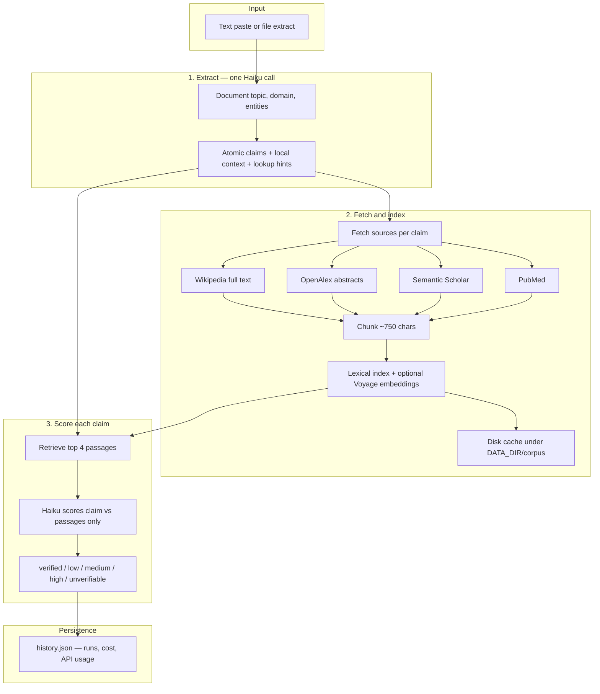
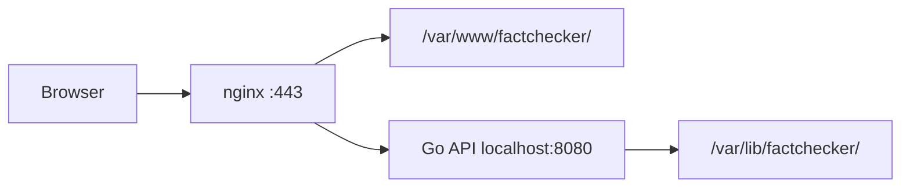
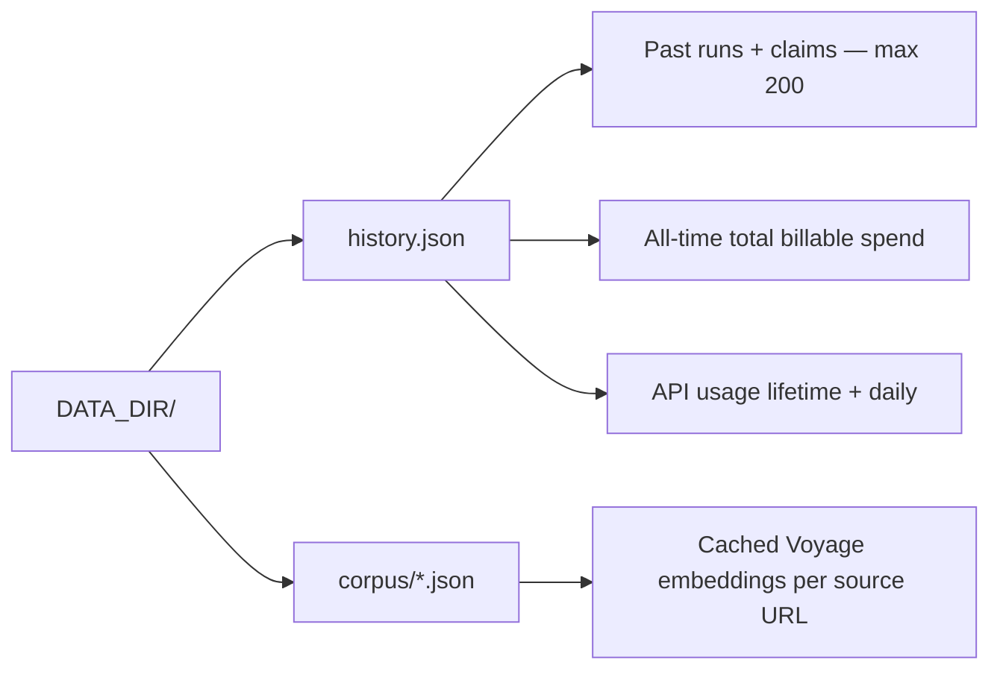

# Claim Inspector

An open-source fact-checking tool: paste or upload text, and each factual claim is checked against reputable sources, scored by risk, and highlighted in the UI. Runs, cumulative spend, and external API usage persist across restarts in `history.json`.

## Table of contents

- [Features](#features)
- [How it works](#how-it-works)
- [User interface](#user-interface)
- [Supported file formats](#supported-file-formats)
- [Stack](#stack)
- [Cost](#cost)
- [Configuration](#configuration)
- [Running locally](#running-locally)
- [Production deployment](#production-deployment)
- [Data on disk](#data-on-disk)
- [API reference](#api-reference)
- [Known limitations](#known-limitations)
- [Contributing](#contributing)
- [License](#license)

---

## Features

- Extracts atomic factual claims from prose with Claude Haiku
- Retrieves evidence from Wikipedia, OpenAlex, Semantic Scholar, and PubMed
- Chunks and indexes source text; optional Voyage semantic search over passages
- Scores each claim: verified, low, medium, high, or unverifiable
- Instant mode (SSE progress) or batch mode (50% off Haiku scoring via Anthropic Batch API)
- Pre-run cost estimates and post-run breakdown (Haiku + billable OpenAlex/Voyage)
- Persistent history (200 runs), all-time spend, and API usage meters
- Simple password auth protecting your API keys

---

## How it works



**Why chunk + retrieve?** Full Wikipedia articles are too long to send to Haiku for every claim. The app indexes the full text once, then pulls only the top **4** passages that match each claim (keyword search, plus **Voyage** semantic search when `VOYAGE_API_KEY` is set).

**Provider routing** — not every database runs for every claim. Extraction assigns `providers` per claim (e.g. PubMed only for medical claims, OpenAlex for research-heavy claims). Wikipedia is almost always included.

**Fetch deduplication** — during indexing, a per-run cache ensures each Wikipedia article, OpenAlex search, Scholar search, and PubMed search is fetched **once**, even when many claims share the same source or query.

---

## User interface

After signing in, the main screen is a single page with status bars at the top, an input area, and results below.

### Top bars

**Cost bar (all-time / session)**  
Tracks **total billable spend** per run: Anthropic (Haiku) plus OpenAlex/Voyage after free-tier credits. Token counts are Haiku only.

| Field | Meaning |
|-------|---------|
| **All-time** | Total USD (Haiku + billable APIs) + Haiku input/output tokens since the server first saved a run |
| **This session** | USD and run count since you signed in (resets on page refresh) |

**API usage bar**  
Tracks **every external service** the backend calls. Counters live in `history.json` and reset daily (UTC) where providers have daily limits. Hover a provider name for notes. Orange bars mean ≥80% of a tracked limit.

| Provider | What is counted | Tracked limit |
|----------|-----------------|---------------|
| Anthropic | Input + output tokens | None (`MAX_COST_USD` is estimate-only preflight; see [Configuration](#configuration)) |
| Voyage | Embedding tokens + API calls | 200M tokens free tier (account lifetime) |
| OpenAlex | Search calls + estimated USD | $1/day free API credit |
| Wikipedia | HTTP requests | 5,000/day soft budget |
| Semantic Scholar | HTTP requests | 5,000/day soft budget |
| PubMed | HTTP requests | 10,000/day soft budget |

Deleting a past run removes only the saved results; **cost** and **API usage** totals are unchanged (they track real API consumption).

### Header

Title row with **sign out**. Source line lists the databases the app can query (Wikipedia, OpenAlex, Semantic Scholar, PubMed).

### Past fact-checks

Collapsible history of saved runs (newest first, **max 200**). Each row shows date, mode (`sync` = instant, `batch`), claim count, flagged count, cost, **rename**, and **delete**.

**Click a row** to reload **claim results and cost** into the results panel. Original input text is **not stored** — only a short auto-title (~80 characters) for display. Annotated highlighting is unavailable for history loads; claim cards are complete.

### Input area

| Control | Purpose |
|---------|---------|
| **Input text** | Paste prose, or drag-and-drop a file |
| **load sample** | Fills the editor with demo frog text |
| **upload file** | `.txt`, `.md`, `.html`, `.docx`, `.pdf` |
| **Estimate pill** | Appears while typing — approximate claim count and **total** cost (Haiku + billable APIs) |
| **Name this fact-check** | Optional label stored in history (overrides auto title when set) |

**File upload behavior:**

- `.txt` / `.md` — read in the browser
- `.html` / `.docx` / `.pdf` — sent to `POST /extract/file` for server-side conversion, then loaded into the editor
- Files **>15,000 bytes** auto-enable batch mode
- Textarea length **>3,000 characters** shows a large-document batch suggestion banner

### Batch mode toggle

| | **Instant (default)** | **Batch** |
|---|----------------------|-----------|
| Speed | Seconds to a few minutes | Up to 24h for Anthropic to score (often minutes) |
| Haiku cost | Full Haiku pricing on extraction + scoring | Full price on **extraction**; **50% off scoring** only (Anthropic Batch API) |
| Progress | Live SSE stream (`POST /analyze/stream`) | HTTP submit blocks while server extracts + indexes (up to **180s**), then poll `GET /batch/:id` every 8s |
| Best for | Normal documents | Very large docs, rate-limit avoidance |

When batch is on, a blue panel shows estimated **total** cost and Haiku-only batch savings.

**Batch job caveat:** Job status is kept **in memory** on the server (not persisted). Completed runs are saved to `history.json`. If the **server restarts** while a batch is in flight, `GET /batch/:id` returns 404 — check **Past fact-checks** after a few minutes; the run may already be saved. If you **refresh the browser** mid-batch, polling stops; keep the tab open or check history later.

### Analyze and progress

**Analyze Claims** starts a run. Instant mode uses Server-Sent Events:

1. Status messages — e.g. *Extracting claims…*, *Indexing sources (chunk + retrieve)…*
2. Topic line after extraction (when available)
3. Progress bar — claims scored (`3/8 · 38%`) with the current claim snippet

**Last run** next to the button shows total cost (Haiku + billable APIs), with a Haiku/API split when applicable, plus token counts.

Instant runs have a **180-second server timeout**. Very large documents may need batch mode.

### Results

**Annotated text** (instant runs only) — click a highlighted claim to open its card.

**Risk colors**

| Color | Risk | Meaning |
|-------|------|---------|
| Green | Verified | On-topic sources clearly support the claim |
| Yellow | Low | Mostly supported; minor nuance |
| Orange | Medium | Partial support or oversimplification |
| Red | High | Sources contradict or show a major error |
| Gray | Unverifiable | No on-topic source addresses the claim |

**Claim cards** — explanation plus **Sources** links. Each source is a retrieved *passage* (not necessarily the whole article), labeled with provider (`wikipedia`, `openalex`, `semantic_scholar`, `pubmed`).

---

## Supported file formats

| Format | How it works |
|--------|----------------|
| `.txt` | Read in browser or server |
| `.md` | Markdown stripped to plain text (server) |
| `.html` | Tags/scripts/styles removed (server) |
| `.docx` | Text extracted from document XML (server) |
| `.pdf` | Text-based PDFs via **`pdftotext`** on the server — **scanned/image PDFs not supported** |

Strip headers, footers, and page numbers before upload when possible — they add tokens but rarely contain checkable claims.

---

## Stack

| Layer | Technology |
|-------|------------|
| Backend | Go 1.22+, stdlib only (no third-party Go modules) |
| Frontend | React 18 + Vite |
| Reasoning | Claude Haiku 4.5 (`claude-haiku-4-5-20251001`) |
| Retrieval | Voyage `voyage-4-lite` embeddings (optional) + lexical search |
| Sources | Wikipedia, OpenAlex, Semantic Scholar, PubMed |
| Persistence | JSON files under `DATA_DIR` |

**System dependency:** `pdftotext` (Poppler) on the server PATH for PDF extraction.

**Project layout:**

```
Claim-Inspector/
├── backend/
│   ├── cmd/server/       # Entry point
│   ├── internal/         # API, claims, sources, store, …
│   └── .env.example
├── frontend/
│   ├── src/App.jsx       # UI
│   └── .env.example
└── README.md
```

---

## Cost

Haiku pricing (May 2026): **$1 / M input tokens**, **$5 / M output tokens**. The UI shows exact Haiku token usage from API responses.

| Component | Pricing notes |
|-----------|----------------|
| **Instant Haiku** | Full price on extraction + per-claim scoring |
| **Batch Haiku** | Full price on extraction; **50% off scoring tokens** (Anthropic Batch API) |
| **Voyage** | 200M embed tokens free, then $0.02/M on `voyage-4-lite` |
| **OpenAlex** | ~$0.001/search; $1/day free credit |
| **Wikipedia / Scholar / PubMed** | Free (soft request budgets tracked in UI) |

Pre-run estimates and post-run `exact_cost_usd` include **billable aux APIs** after free-tier credits. Hover cost lines for per-provider breakdown.

| Volume (Haiku only, rough) | Instant | Batch scoring ~50% off |
|----------------------------|---------|-------------------------|
| ~10 pages | ~$0.01 | ~$0.007 |
| ~100 pages | ~$0.09 | ~$0.06 |

---

## Configuration

Copy `backend/.env.example` to `backend/.env` (local) or `/etc/factchecker/.env` (production).

### Backend — required

| Variable | Description |
|----------|-------------|
| `ANTHROPIC_API_KEY` | [console.anthropic.com](https://console.anthropic.com) |
| `APP_USERNAME` | Web login username |
| `APP_PASSWORD` | Web login password — protects your API keys |

### Backend — optional

| Variable | Default | Description |
|----------|---------|-------------|
| `MAX_COST_USD` | unlimited | **Preflight only:** reject analyze with HTTP 402 when the **estimated** total (Haiku + billable APIs) would exceed remaining budget. Actual spend is not re-checked after a run completes. |
| `ALLOWED_ORIGIN` | `*` | CORS origin — set to your `https://` domain in production |
| `PORT` | `8080` | Backend listen port (localhost only in production; nginx proxies public traffic) |
| `DATA_DIR` | `data` | History, cost, API usage, and corpus cache root |
| `VOYAGE_API_KEY` | — | [voyageai.com](https://www.voyageai.com) — semantic chunk retrieval (200M free tokens on lite models) |
| `OPENALEX_API_KEY` | — | [openalex.org/settings/api](https://openalex.org/settings/api) — scholarly search ($1/day free credit). Works without it |
| `CORPUS_CACHE_DIR` | `DATA_DIR/corpus` | Override embedding cache location |

### Frontend

| Variable | Default | Description |
|----------|---------|-------------|
| `VITE_API_URL` | `http://localhost:8080` | Backend base URL (no trailing slash). **Production:** set to your public site origin, e.g. `https://yourdomain.com`, because nginx serves the UI and proxies API routes on the same host |

### Example production `.env` (backend)

```
ANTHROPIC_API_KEY=sk-ant-api03-...
VOYAGE_API_KEY=pa-...
APP_USERNAME=jacob
APP_PASSWORD=long-random-password
MAX_COST_USD=10.00
ALLOWED_ORIGIN=https://yourdomain.com
PORT=8080
DATA_DIR=/var/lib/factchecker
```

Never commit `.env` files.

---

## Running locally

**Prerequisites:** Go 1.22+, Node.js 18+, `pdftotext` (optional, for PDF upload).

**Backend:**

```bash
cd backend
cp .env.example .env    # edit with your keys
go run ./cmd/server
# http://localhost:8080 — data in ./data/
```

**Frontend** (separate terminal):

```bash
cd frontend
cp .env.example .env    # VITE_API_URL=http://localhost:8080
npm install && npm run dev
# http://localhost:5173
```

There is no Vite dev proxy — the frontend calls the backend directly. Set `ALLOWED_ORIGIN=http://localhost:5173` in the backend `.env`, or leave it unset to use `*` during development.

---

## Production deployment

Deploy on a Linux VPS (e.g. Ubuntu on DigitalOcean). The backend listens on **localhost:8080**; **nginx** serves the React build on port 80/443 and forwards API paths to the Go server.



### Where files live on the server

| What | Path |
|------|------|
| Backend binary | `/usr/local/bin/factchecker-server` |
| Backend env | `/etc/factchecker/.env` |
| systemd unit | `/etc/systemd/system/factchecker.service` |
| App data (history, corpus cache) | `/var/lib/factchecker/` |
| Frontend static files | `/var/www/factchecker/` |
| nginx site config | `/etc/nginx/sites-available/factchecker` |

### Step-by-step

**1. Install system packages**

```bash
sudo apt update
sudo apt install nginx poppler-utils   # poppler-utils provides pdftotext
```

**2. Create directories and backend env**

```bash
sudo mkdir -p /etc/factchecker /var/lib/factchecker /var/www/factchecker
sudo nano /etc/factchecker/.env
sudo chmod 600 /etc/factchecker/.env
sudo chown www-data:www-data /var/lib/factchecker
```

Fill `/etc/factchecker/.env` using the [example above](#example-production-env-backend). Set `DATA_DIR=/var/lib/factchecker` and `ALLOWED_ORIGIN=https://yourdomain.com`.

**3. Build and install the backend**

On the server (or cross-compile from your machine):

```bash
cd backend
GOOS=linux GOARCH=amd64 go build -o factchecker-server ./cmd/server
sudo cp factchecker-server /usr/local/bin/factchecker-server
```

**4. Create the systemd service**

Create `/etc/systemd/system/factchecker.service`:

```ini
[Unit]
Description=Claim Inspector Backend
After=network.target

[Service]
ExecStart=/usr/local/bin/factchecker-server
WorkingDirectory=/etc/factchecker
EnvironmentFile=/etc/factchecker/.env
Restart=always
RestartSec=5
User=www-data

[Install]
WantedBy=multi-user.target
```

Enable and start:

```bash
sudo systemctl daemon-reload
sudo systemctl enable --now factchecker
sudo journalctl -u factchecker -f
# Expect "Voyage embeddings enabled" or "lexical only"
```

**5. Build and install the frontend**

```bash
cd frontend
npm install
echo "VITE_API_URL=https://yourdomain.com" > .env
npm run build
sudo cp -r dist/* /var/www/factchecker/
```

**6. Configure nginx**

This config is **not in the repo** — create it on the server:

```bash
sudo nano /etc/nginx/sites-available/factchecker
```

Paste (replace `yourdomain.com` with your domain or droplet IP while testing):

```nginx
server {
    listen 80;
    server_name yourdomain.com;
    root /var/www/factchecker;
    index index.html;

    location / {
        try_files $uri /index.html;
    }

    location ~ ^/(analyze|extract|login|logout|health|estimate|batch|history) {
        proxy_pass http://localhost:8080;
        proxy_set_header Host $host;
        proxy_set_header X-Real-IP $remote_addr;
        proxy_set_header Connection '';
        proxy_http_version 1.1;
        proxy_buffering off;
        proxy_cache off;
        client_max_body_size 10M;
        proxy_read_timeout 86400s;
    }
}
```

The regex matches `/analyze`, `/analyze/stream`, `/analyze/file`, `/extract/file`, `/batch/…`, and `/history/…`.

Enable the site:

```bash
sudo ln -s /etc/nginx/sites-available/factchecker /etc/nginx/sites-enabled/
sudo rm /etc/nginx/sites-enabled/default   # optional on a fresh droplet
sudo nginx -t
sudo systemctl reload nginx
```

If you already have an nginx site for this domain, edit that file instead of creating a duplicate `server { }` block.

**7. HTTPS (recommended)**

```bash
sudo apt install certbot python3-certbot-nginx
sudo certbot --nginx -d yourdomain.com
```

Then set `ALLOWED_ORIGIN=https://yourdomain.com` in `/etc/factchecker/.env` and restart:

```bash
sudo systemctl restart factchecker
```

**8. Verify**

- Open `https://yourdomain.com` — login page loads
- `curl https://yourdomain.com/health` → `{"status":"ok"}`
- Run a small fact-check; confirm **Past fact-checks** and cost bars update

### Updating a deployment

1. `git pull`
2. Rebuild backend → `/usr/local/bin/factchecker-server` → `sudo systemctl restart factchecker`
3. Rebuild frontend → `/var/www/factchecker/` (hard-refresh browser)
4. Add any new `.env` keys before restart
5. Reload nginx only if you changed the site config (`sudo nginx -t && sudo systemctl reload nginx`)

---

## Data on disk



Set `DATA_DIR` to an absolute path on a VPS (e.g. `/var/lib/factchecker`) so redeploying the binary does not wipe history or embedding cache.

---

## API reference

**Public routes:** `GET /health`, `POST /login`  
**All other routes** require `Authorization: Bearer <token>` (24h session, in-memory on server).

Analyze routes return **HTTP 402** if a preflight estimate would exceed `MAX_COST_USD` (estimate-only; see [Configuration](#configuration)).

### Authentication

**`POST /login`**

```json
{ "username": "...", "password": "..." }
→ { "token": "..." }
```

**`POST /logout`** — invalidate session (requires Bearer token).

### Cost estimate

**`POST /estimate`** — pre-run cost, no external API calls:

```json
{ "text": "..." }
→ {
    "estimated_claims": 5,
    "est_input_tokens": 8200,
    "est_output_tokens": 1100,
    "anthropic_cost_usd": 0.022,
    "est_aux_cost_usd": 0.0,
    "est_cost_usd": 0.022,
    "est_cost_batch_usd": 0.018,
    "voyage_enabled": true,
    "aux_costs": [
      { "provider": "openalex", "label": "OpenAlex", "amount_usd": 0, "note": "within $1/day OpenAlex free credit" },
      { "provider": "voyage", "label": "Voyage embeddings", "amount_usd": 0, "note": "within 200M token Voyage free tier" }
    ],
    "model": "claude-haiku-4-5-20251001"
  }
```

### File extraction

**`POST /extract/file`** — multipart form field `file` (max 10 MB):

```json
→ { "text": "...", "filename": "report.pdf" }
```

Used by the web UI for `.html`, `.docx`, and `.pdf` before analyze.

### Analyze (one pipeline, three transports)

All analyze routes run **extract → fetch/index → score → save**. They differ in transport and batch vs instant:

| Endpoint | Used by UI? | Behavior |
|----------|-------------|----------|
| `POST /analyze/stream` | **Yes** — instant mode | Server-Sent Events: status, progress, final JSON in `done` event. **`batch: true` rejected (400).** 180s timeout. |
| `POST /analyze` | **Yes** — batch submit | `"batch": true` → blocks up to **180s** while server extracts + indexes, then returns `{ "batch_id": "..." }`; poll `GET /batch/:id`. `"batch": false` → sync JSON (no SSE). |
| `POST /analyze/file` | Scripts only | Multipart upload → same as `/analyze`. Web UI uses `/extract/file` + paste instead. |

**JSON body** (paste routes): `{ "text": "...", "batch": false, "label": "...", "filename": "..." }`

**Instant SSE events** (`POST /analyze/stream`):

```
event: status      data: {"message":"Extracting claims…"}
event: extracted   data: {"total":4,"topic":"frog biology","domain":"science"}
event: status      data: {"message":"Indexing sources (chunk + retrieve)…"}
event: progress    data: {"done":2,"total":4,"current":"The horror frog…"}
event: done        data: {"claims":[...],"cost":{"anthropic_cost_usd":0.02,"exact_cost_usd":0.02,"aux_costs":[],"usage":{...}}}
event: error       data: {"message":"..."}
```

**Batch:** `POST /analyze` with `"batch": true` → poll `GET /batch/:id` every few seconds until `status` is `done` or `failed`.

Claim `sources[]` entries include `provider`: `wikipedia`, `openalex`, `semantic_scholar`, or `pubmed`.

### History

**`GET /history`**

```json
→ {
    "runs": [...],
    "total_input_tokens": 42000,
    "total_output_tokens": 8400,
    "total_cost_usd": 0.084,
    "api_usage": {
      "daily_reset_utc": "2026-06-04",
      "providers": [
        { "id": "voyage", "display_name": "Voyage Embeddings", "unit": "tokens",
          "period": "account", "limit": 200000000, "used_lifetime": 12000, "pct_used": 0.006, "note": "..." }
      ]
    }
  }
```

Each run's `cost` object:

```json
{
  "model": "claude-haiku-4-5-20251001",
  "anthropic_cost_usd": 0.018,
  "exact_cost_usd": 0.018,
  "aux_costs": [],
  "usage": { "input_tokens": 12000, "output_tokens": 800 }
}
```

**`PATCH /history/:id`** — rename run: `{ "label": "..." }`  
**`DELETE /history/:id`** — remove run from history (all-time totals unchanged)

### Other routes

| Method | Path | Purpose |
|--------|------|---------|
| `GET` | `/batch/:id` | Poll async batch job (in-memory until complete) |
| `GET` | `/health` | `{ "status": "ok" }` |

---

## Known limitations

| Topic | Detail |
|-------|--------|
| **Spend cap** | `MAX_COST_USD` blocks requests whose **estimate** exceeds the remaining budget. Actual cumulative spend can exceed the cap if estimates are low or many runs complete quickly. |
| **Batch jobs** | In-memory only on the server; lost on restart. Browser refresh stops polling (no `batch_id` in local storage). |
| **Batch submit timeout** | `POST /analyze` with `batch: true` blocks up to **180s** for extract + index before returning `batch_id`. Very large documents may fail here. |
| **History** | Max **200** runs; full input text **not** stored (only ~80-char title + claims). |
| **Sessions** | Auth tokens in-memory on server (24h); stored in browser as `fc_token` in `sessionStorage`; lost on server restart. |
| **Instant timeout** | `/analyze/stream` has a **180s** server deadline. |
| **Annotated text** | Requires claim text to match input exactly; duplicate phrases in input may not all highlight. |
| **Scanned PDFs** | Not supported (needs `pdftotext` on text-based PDFs only). |

---

## Contributing

PRs welcome. Sensible extensions:

- OCR for scanned PDFs
- Non-English claim extraction
- Persist full input text in history
- Persist in-flight batch jobs across restarts
- Additional source APIs
- Multi-user accounts
- Export results (CSV/PDF)

---

## License

MIT
